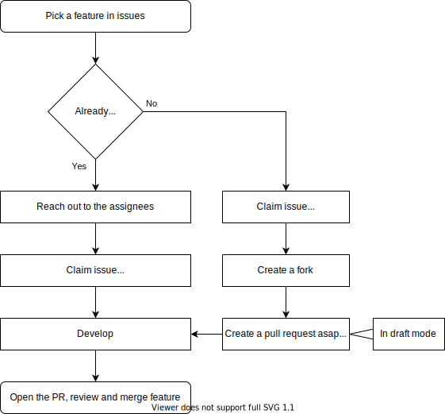
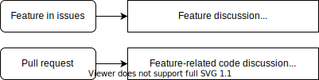

<style>
img {
	position:relative;
	left: 50%;
	transform: translate(-50%);
}
</style>
> This file is very similar to the `CONTRIBUTING.md` of `virtual-mmx`

> This is not the bible, but sticking to this will ensure that you don't waste your time and talent.

## GitHub flow

If you're unfamiliar with the GitHub flow, [this](https://guides.github.com/introduction/flow/) is a good, 5 minute long introduction. We're using the **Fork & Pull** model.

**Issues** marked as feature are the base of our flow. These mark single bits of work (tasks, features) that can be done in parallel.

If someone wants to work on a feature, they should **comment "Claim"** to be assigned to the issue by a maintainer.

**Pull requests** (PR) should be created as soon as possible. It's a good idea to set them to [draft mode](https://help.github.com/en/github/collaborating-with-issues-and-pull-requests/about-pull-requests#draft-pull-requests "draft mode") since they'll be around for some time. Undo this once others should review and accept the PR.



<p align="center">
	ℹ️ <a href="https://help.github.com/en/github/getting-started-with-github/fork-a-repo">Forks</a>
	| <a href="https://help.github.com/en/github/collaborating-with-issues-and-pull-requests/creating-a-pull-request-from-a-fork">Creating a PR from a fork</a>
</p>

While the issue is the place to discuss the feature, the PR is the place to discuss the code (usually between assignees).


<p align="center">
	ℹ️ <a href="https://guides.github.com/pdfs/markdown-cheatsheet-online.pdf">GitHub Flavored Markdown</a>
</p>

## Contributing

We use [TypeScript](https://www.typescriptlang.org/) for the schema

To aid our eyes, we use [Prettier](https://prettier.io/docs/en/editors.html) with the following `.prettierrc` configuration:

```json
{
	"useTabs": true
}
```

Use [eslint](https://eslint.org/) to highlight code problems.

> In the future, Prettier and eslint will be checked against before merging.
